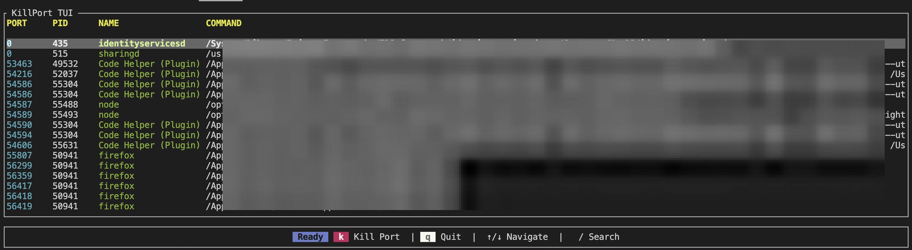

# Killport-tui 🦀

A lightweight, terminal-based tool to view open ports and kill the processes occupying them. Built with Rust and Ratatui.


## Overview

`killport-tui` provides a visual interface for managing system processes that are listening on network ports. Instead of chaining `lsof`, `grep`, and `kill` commands manually, you can browse, filter, and terminate processes directly from a clean TUI.

## Features

- **Visual Dashboard:** View Port, PID, Process Name, and Command details in a table.
- **Search & Filter:** Press `/` to filter processes by name, PID, or port number.
- **Safety First:** "Confirm to Kill" modal prevents accidental shutdowns.
- **Cross-Platform:** Works on Linux, macOS, and Windows.
- **Lightweight:** Built with Rust for high performance and low resource usage.

## Installation

### Option 1: Using Cargo (Recommended)

If you have Rust installed, you can install directly from the repository:

```bash
cargo install --git [https://github.com/last1chosen/killport-tui](https://github.com/last1chosen/killport-tui)


# Build and run
cargo run --release
```

## Usage

### Key bindings

| Key   | Action                                    |
| ----- | ----------------------------------------- |
| ↑ / ↓ | Navigate the list of ports                |
| /     | Search mode (Type to filter list)         |
| k     | Kill mode (Opens confirmation dialog)     |
| y     | Confirm kill (inside confirmation dialog) |
| n/Esc | Cancel kill                               |
| Esc   | Exit search mode / Cancel action          |
| q     | Quit application                          |

### Built with

    Ratatui - The TUI library.

    Crossterm - Terminal manipulation.

    Sysinfo - System handling.

    Listeners - Port detection.

## Screenshots


